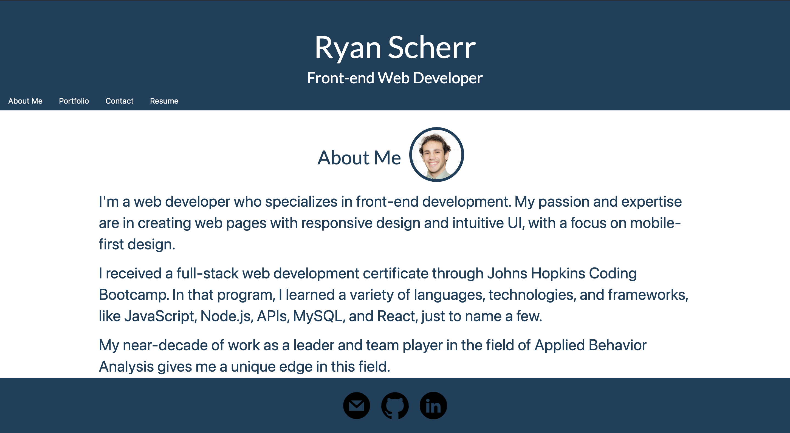
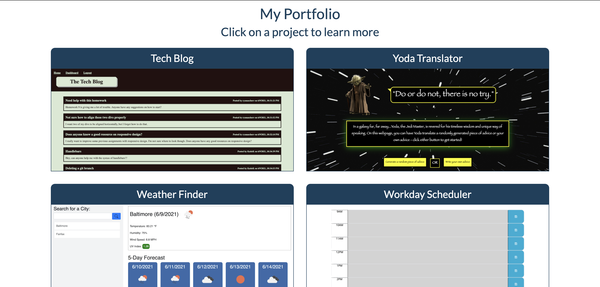
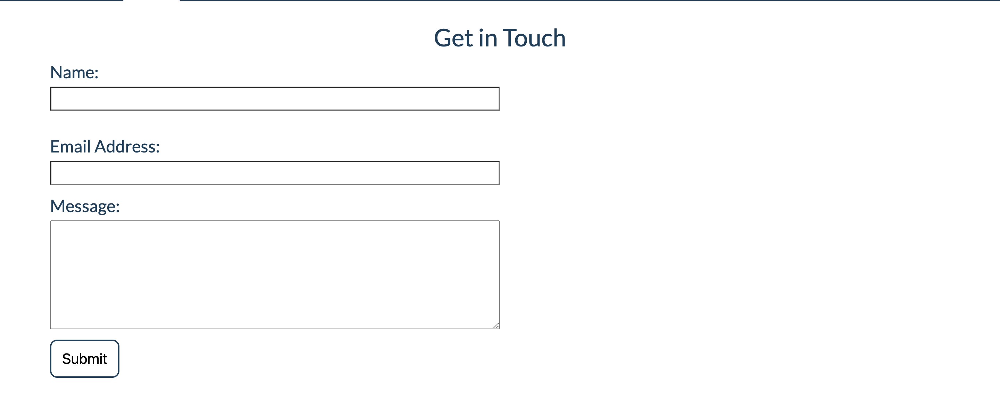
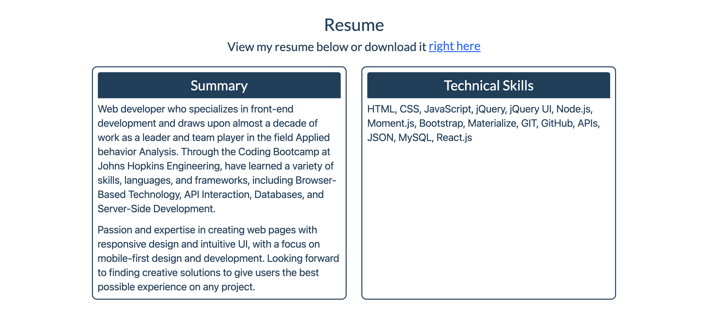

# Ryan Scherr's Portfolio Page

## Description

This portfolio page was created to show off Ryan Scherr's ablities as a coder, and was made entirely with React.

The page tells users a short bit about Ryan's history, shows off projects he has made, and gives several ways to contact him. A navigation bar at the top of the page allows users to quikly jump to the information they are seeking, and clicking on images of his projects will give users more information and ways to navigate to the project and its repository.

## Installation

There is no installation required to use this webpage.

## Usage

Users can use the navitgation tab at the top of the page to view the various sections of Ryan's amazing portfolio.

## Features

This website was made entirely with React and features conditional rendering.

## Credits

Jeff DeRosalia, Dan Rosenbaum

## Link

https://ryanascherr.github.io/react-portfolio/

## Contact Information

ryanascherr@gmail.com
